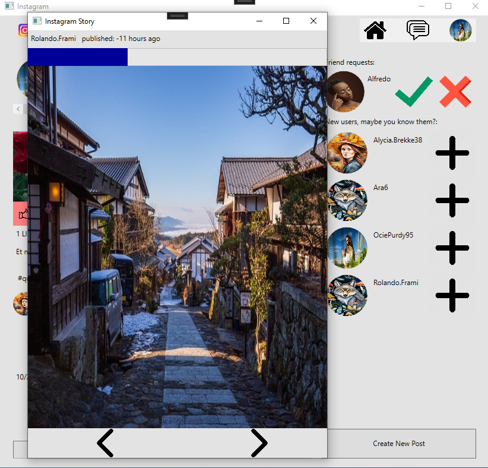

# Krótki opis aplikacji

Aplikacja jest wzorowana na popularnym instagramie, którego głównymi funkcjami jest umieszczanie postów, stories (zdjęć widocznych tylko przez 24h) oraz komunikacji ze znajmomymi.

# Użyte biblioteki i wzorce projektowe

Biblioteki:
- Entity Framework Core
- Nlog
- Newtonsoft.json
- XUnit
- Bogus

Wzorce projektowe:
- MVVM
- Repositories Pattern
- Factory Pattern
- Dependency Injection

Inne:
- Szyfrowanie haseł przez hashowanie

# Zdjęcia gotowego projektu i jego funkcji

Okno logowania:
- pozwala zalogować się na konto
- pozwala stworzyć konto
- posiada walidacje loginu i hasła

Okno tworzenia konta:
- pozwala stworzyć konto wraz ze zdjęciem

Główne okno:
- posiada po lewej stronie posty użytkowników
- posty posiadają: polubienia, komentarze, oraz odpowiedzi na komentarze
- posiada po prawej użytkowników, których możemy znać i zaproszenia do znajomych
- nad postami znajdują się stories (zdjęcia dostępne tylko przez 24h)
- na górze jest miejsce, w którym możemy wyszukiwać użytkowników po ich nazwach
- na górze po prawej stronie jest menu, które pozwala: wrócić na główną stronę, przenieść się do komunikatora i edytować konto

- w menu możemy zmienić kolor tła na ciemny

- edytowanie profilu użytkownika

- znajomi w komunikatorze

- konwersacja w komunikatorze

- wyszukiwanie użytkowników

- sprawdzanie profilu użytkownika

Okno tworzenia postów:
- pozwala opublikować post
- posiada walidację wpisywanych danych

Stories oraz ich tworzenie:
- pozwala opublikować zdjęcia na 24 godziny

- tworzenie story

- wyświetlanie story

# Creditsy:

Zdjęcia do wygenerowania kont i postów pobrane z:
https://pixabay.com/

Algorytm hashowania:
https://www.sean-lloyd.com/post/hash-a-string/

# Jak zainstalować? (Quick start)

niedługo :)

# Kim jest kontrybutor?

Jest to moje stare konto, z którego przez prypadek dodałem commita i już tak zostało :)